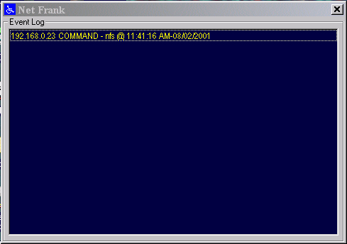



## Net Frank

### Description

To control a "friends" computer remotely. Instructions and FRANKINAL application included.
 
### More Info
 

             |
---                |---
**Submitted On**   |2001-02-08 11:39:04
**By**             |[Niknak\!\! \<OLD\>](https://github.com/Planet-Source-Code/PSCIndex/blob/master/ByAuthor/niknak-old.md)
**Level**          |Advanced
**User Rating**    |5.0 (10 globes from 2 users)
**Compatibility**  |VB 6\.0
**Category**       |[Miscellaneous](https://github.com/Planet-Source-Code/PSCIndex/blob/master/ByCategory/miscellaneous__1-1.md)
**World**          |[Visual Basic](https://github.com/Planet-Source-Code/PSCIndex/blob/master/ByWorld/visual-basic.md)
**Archive File**   |[CODE\_UPLOAD14676282001\.zip](https://github.com/Planet-Source-Code/niknak-old-net-frank__1-15087/archive/master.zip)

